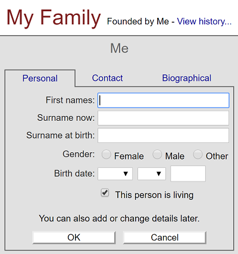
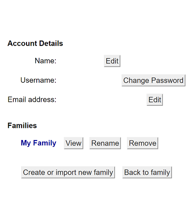

## About
Last Updated 23 July 2018  
Created by Wendy Jordan | Updated by Chelsea Smith-Antonides

## Table of Contents
* [What is Family Echo?](#what-is-family-echo)
* [How to Create a Tree on Family Echo](#how-to-create-a-tree-on-family-echo)
  * [Create a Family Echo Account](#create-a-family-echo-account)
  * [Building Your Family Tree](#building-your-family-tree)
* [Including Your Tree as an HTML iframe on your site](#including-your-tree-as-an-html-iframe-on-your-site)

## What is Family Echo?
Family Echo is a free online website that allows users to make their own family trees. One user can have several different family tree projects, allowing you to create multiple personal trees or even historical trees for research. 

[Return to Top](#about)

## How to Create a Tree on Family Echo

### Create a Family Echo Account
* Go to [https://www.familyecho.com/](https://www.familyecho.com/)
* Click **Sign In** in the upper right corner, and then select __Create a new Family Echo Account__. Enter a Username, Password, and email address.
* Family Echo is free to use.

[Return to Top](#about)

### Building Your Family Tree
* You will be asked to enter your name and information; if you are making your personal family tree, do this. If you are making a historical family tree that is not personal to you, simply fill in the information for the first person in the tree you wish to include.
* After filling in the information for the first person on your tree, use the different options located on the left side of the screen to add relatives. You can add biographical details, career information, contact information, and even interests or activities to make each entry as detailed as possible. 
* Repeat this process, adding relatives, until you have included each person you wish to add to your tree. You can always go back and add more information, edit your information, or add more relatives, later. 

* Details can include: 
  - Birth/Death Date 
  - Name 
  - Gender 
  - Partners/Exes 
  - Biographical Information 
  - A Photo

* Each person you add will automatically be added to the branch on the right side of the screen. 
* When you're ready to save you Family Tree, select **Save**. It will automatically save the tree to your account under the title **My Family**. 
* To change the title of your tree, go to **My Account** in the upper right corner and then select the **Rename** button next to your tree.

[Return to Top](#about)

## Including Your Tree as an HTML iframe on your site
The technical difficulty with family echo is that its general options for exporting a family tree are slightly complicated, and are not compatible with Omeka, which is where this particular tree was being put. The best possible way to combat this was by using an *HTML iframe*.
* To use an iframe of your family tree, select someone on the tree *Without a Death Date* and then click to ***Share*** button in the upper right hand corner of the page; this is because Family Echo by design assumes you are working with some living people, and you therefore cannot share with a non-living person.
   * This selected person will be the first person visitors to your site will see in your iframe. 
   * If you would like someone else to be the first person that visitors will see, go back and delete their death date and repeat the share process. You can always re-add it after creating the iframe on your website. 
* Copy the link found in the URL box. 

* Go to your Omeka admin dashboard for your site. *These instructions will be geared specifically to Omeka, but you can follow the same basic steps for any platform supports html editing like WordPress)*
* Navigate to edit the page on wish you want to put your family tree. Select **HTML** above the text box for the page.
* Type < iframe src="yourcopiedlinkhere"> < /iframe>
* **Save Changes** to the HTML Editor window.
* **Save Changes** to your page.
* Make sure the page is public. Your family tree should now be visible.
* To change the dimensions of the iframe of your family tree on the site, go back into the HTML editor. Some other code will have been added automatically to the iframe you typed out. In this code you will find a spot that says width="some number" and height="some number"; alter the numbers only to adjust your preferred dimensions. Do not forget to save changes each time for the new dimensions of your iframe to take effect.   

[Return to Top](#about)
